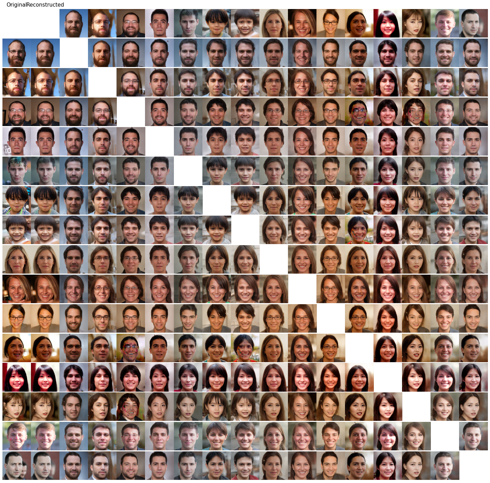
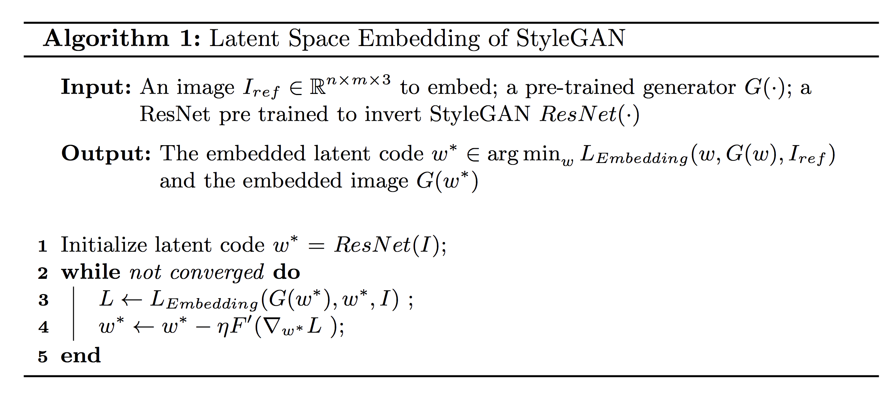
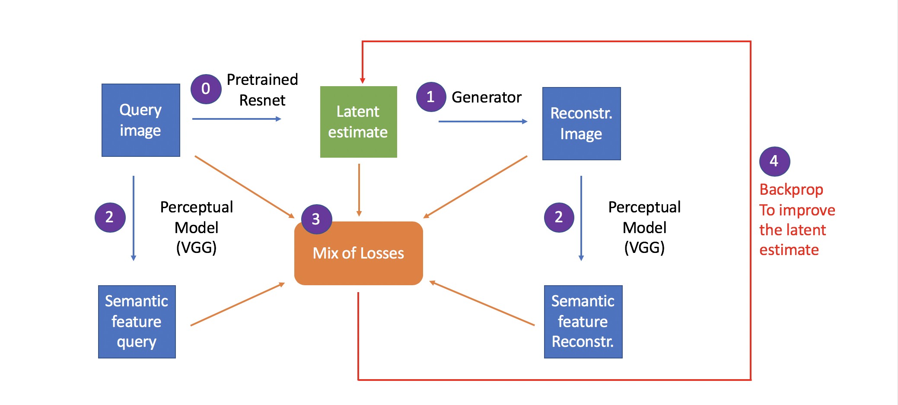
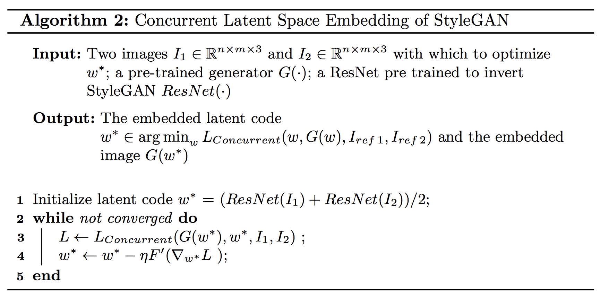
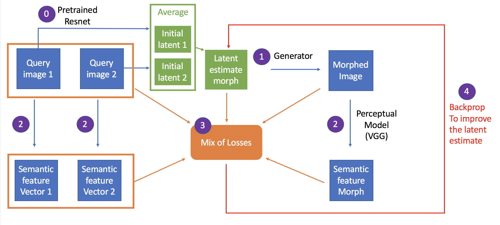

## Face Morphing with StyleGAN


*This project aims at using a generative adversarial approach to create face morphs.*



Left columns: original and reconstructed images. Other images in rows and columns: faces morphs produced  

## Usage
Usage: The simplest way to get started and to perform face morphing is to run this [colab notebook](https://colab.research.google.com/drive/1NJkGIgRTbeJ2754fuDNhf-RtUjV6nzkv) which uses the scripts in this repo.
You can also find this notebook [here](https://github.com/antoinedandi/FaceMorphing/blob/master/notebooks/FaceMorphing.ipynb).


## Face morphing approaches

#### Face morphing by encoding and interpolating the latent space of a pretrained StyleGAN



#### Face morphing by concurrent optimization in the latent space of a pretrained StyleGAN



## Folder Structure

```
FaceMorphing/
  │
  ├── README.md
  ├── requirements.txt
  │
  ├── align_images.py                            - align faces from input images
  ├── encode_images.py                           - find latent representation of reference images using perceptual losses
  ├── face_morphing_latent_interpolation.py      - perform face morphing by interpolating the latent space of StyleGAN
  ├── face_morphing_concurrent_optimization.py   - perform face morphing with concurrent optimization in the latent space of a pretrained StyleGAN
  ├── train_resnet.py                            - train a ResNet to predict latent representations of images in a StyleGAN model from generated examples
  │
  ├── notebooks/
  │   └── FaceMorphing.py   - Colab notebook containing instructions to perform face morphing
  │
  ├── figures/  - saved figures of face morphing results
  │
  ├── encoder/  - folder containing the models for the generator and for the perceptual loss
  │   ├── generator_model.py                 - model for styleGAN's generator
  │   ├── perceptual_model.py                - model for the perceptual loss in the case of face embedding
  │   └── perceptual_model_concurrent.py     - model for the perceptual loss in the case of concurrent optimization
  │
  ├── utils/ - utils scripts and functions
  │   ├── face_utilities/   - folder containing scripts, functions and models for face alignement, recognition, etc.
  │   └── utils.py 
  │
  └── dnnlib/   - helper library by NVIDIA for deep neural networks
```

## Resources

Pretrained models used by our face morphing scripts are available via the following links:

| Link                              | Description
| :--------------                   | :----------
| [url_styleGAN](https://drive.google.com/uc?export=download&id=1Ru1kpacSvmheTHP7evEGHEegXZjeTaoi)       | Pretrained StyleGAN generator
| [url_resnet](https://drive.google.com/uc?id=1aT59NFy9-bNyXjDuZOTMl0qX0jmZc6Zb)                         | Pretrained ResNet encoder
| [url_VGG_perceptual](https://drive.google.com/uc?export=download&id=1poMANPSNDHALZRuaqJGrl1EVOP1WNjLv) | Pretrained VGG network for the perceptual model


## System requirements

* Both Linux and Windows are supported, but we strongly recommend Linux for performance and compatibility reasons.
* 64-bit Python 3.6 installation. We recommend Anaconda3 with numpy 1.14.3 or newer.
* TensorFlow 1.10.0 or newer with GPU support.
* One or more high-end NVIDIA GPUs with at least 11GB of DRAM. We recommend NVIDIA DGX-1 with 8 Tesla V100 GPUs.
* NVIDIA driver 391.35 or newer, CUDA toolkit 9.0 or newer, cuDNN 7.3.1 or newer.


## Acknowledgements

Thanks to @Puzer for the original styleGAN encoder, of which this is a fork, to @SimJeg for the initial code that formed the basis of the ResNet model used here and to @pbaylies for his fork as well!
